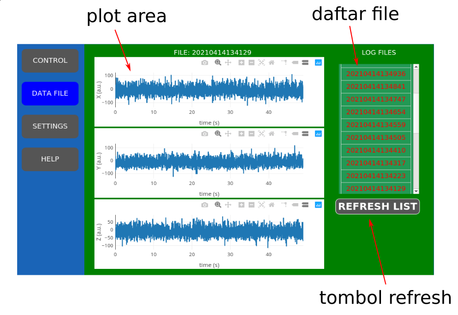
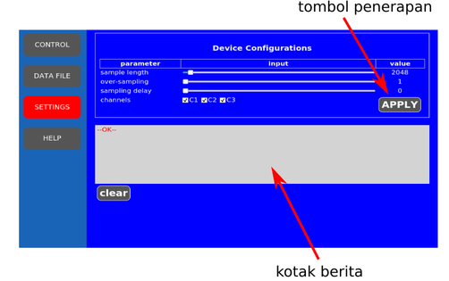

# SEISMOLOG

SEISMOLOG adalah aplikasi terintegrasi dengan piranti perekam getaran cerdas dengan sensor geofon tiga sumbu. Piranti perekam getaran mengikuti standard komunikasi barbasis web. Aplikasi ini tersimpan pada piranti, sehingga bagian penampil tidak dibebani untuk melakukan penjalanan program. Data yang sudah terekam dapat ditransfer melalui koneksi ssh (sftp), dengan menggunakan program-program *sftp-client* atau perintah scp dari komputer pribadi.

Data-data hasil rekam disimpan dalam file dengan format **json**. Field dari data terdiri dari:

* waktu total dari sampling (tsample)
* Penanda waktu (timestamp) pada saat sampling dimulai (tstart)
* Panjang data (length)
* Lokasi pengambilan data (lat, lon)
* Larik data sesuai dengan sumbu sensor (x, y, dan z).

SEISMOLOG berkomunikasi dengan pengguna melalui antar muka web, dengan protokol hypertext (HTTP). Alamat IP dari piranti ditetapkan sebagai 10.1.1.1, sehingga dapat dikendalikan dengan memasukan alamat tersebut pada browser umum. Fungsi kendali dikirimkan dengan request HTTP sebagai berikut:

<verb>
http://10.1.1.1/request/parameter
</verb>

Dengan menggunakan aplikasi ini, maka antarmuka pemakai dengan piranti dapat dilakukan secara sederhana. Perancang perangkat keras, hanya harus mengikuti standar komunikasi melalui http request yang dijelaskan berikut. Data-data yang dikirim berbentuk teks dan format data json, sehingga terbuka dan memudahkan proses data lebih lanjut menggunakan perangkat-perangkat lunak yang ada seperti Python, dan bahasa skrip lainnya.

Fungsi-fungsi piranti diakses melalui request, sesuai dengan daftar berikut: 

<table>
<tr><th>request</th><th>fungsi</th></tr>
<tr><td>
  status
</td><td>
  menampilkan status dari piranti
</td></tr>

<tr><td>
  start/stop
</td><td style='align:left'>
  menjalankan/menghentikan perekaman data
</td></tr>

<tr><td>
  shutdown
</td><td>
  memadamkan unit piranti
</td></tr>

<tr><td>
  list
</td><td>
  mengambil daftar file yang telah terekam
</td></tr>

<tr><td>
  load/filename.json
</td><td>
  memuat file filename.json 
  data diterima dalam format **json**
</td></tr>

<tr><td>
  set/date=tanggal
</td><td>
mengubah tanggal dari piranti 
tanggal ditulis dalam format YY-mm-dd+HH:MM:SS
</td></tr>

<tr><td>
  set/dir=directory
</td><td>
mengubah direktori tempat data disimpan 
default: data
</td></tr>

<tr><td>
  get/free
</td><td>
mengambil informasi storage
</td></tr>

<tr><td>
  get/settings
</td><td>
mengambil informasi pengaturan piranti
</td></tr>

<tr><td>
  get/about
</td><td>
mengambil dokumen pertolongan
</td></tr>

<tr><td>
  get/version
</td><td>
mengambil informasi versi piranti
</td></tr>
<tr><td>
  par/parameter
</td><td>
menerapkan pengaturan piranti melalui parameter. 
format parameter: chanmask=7:block=2048:avg=1:delay=0:lat=0:lon=0
</td></tr>

</table>

# Petunjuk penggunaan web-app SEISMOLOG

SEISMOLOG memiliki 4 tab yang dapat diakses melalui 4 buah kancing di baris kiri, 
seperti terlihat pada gambar di bawah.

Fungsi tab:

* **CONTROL** digunakan untuk mengirim perintah pada perangkat perekam getaran. Dalam tab ini terdapat
  tiga tombol yaitu:
  - **STATUS**: untuk menampilkan statur perangkat.
  - **START**: untuk memulai perekaman. Ketika perekaman sedang dilakukan tombol ini berubah menjadi STOP.
  - **SHUTDOWN**: digunakan untuk mematikan perangkat. Selalu lakukan ini sebelum mencabut perangkat
  dari catudaya.
* **DATA FILE** digunakan untuk melihat data yang sudah direkam. Click pada daftar nama di sebelah kanan untuk
menampilkan grafik tegangan terhadap waktu dari pembacaan sensor. Nama dari file disusun agar file
terbaru berada pada posisi paling atas. Nama file ditentukan sesuai dengan waktu pengambilan data.
* **SETTINGS** digunakan untuk melakukan pengubahan parameter perekaman data.
    - **sample-length** digunakan untuk menentukan panjang data yang direkam dalam satu file
    - **over-sampling** digunakan untuk menentukan jumlah perata-rataan data
    - **sampling-delay** digunakan untuk menentukan jumlah waktu tunggu antara pencuplikan satu datum
    - **channels** digunakan untuk memilih saluran sensor yang digunakan untuk merekam. Terdapat 3 sensor
    sesuai dengan sumbu koordinat x, y, dan z.

## Penampil data

Gambar berikut adalah konfigurasi tab data. Dalam tab ini dapat dilihat daftar file-file yang telah terekam, dan dengan memilih nama file (click pada tabel) data tersebut akan ditampilkan di plot area.

## Pengaturan perekaman data

Parameter-parameter perekaman data piranti SEISMOLOG dapat diatur melalui tab **SETTINGS**, gambar di bawah. Setelah melakukan pengaturan melalui tombol-tombol yang disediakan, harus diterapkan dengan menekan tombol **APPLY**. Respons dari piranti akan terlihat di kotak berita.

