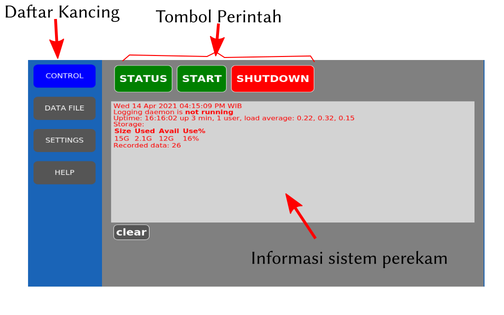

# Penjelasan penggunaan web-app SEISMO-LOG

SEISMO-LOG memiliki 4 tab yang dapat diakses melalui 4 buah kancing di baris kiri, 
seperti terlihat pada gambar di bawah.

Fungsi tab:

* **CONTROL** digunakan untuk mengirim perintah pada perangkat perekam getaran. Dalam tab ini terdapat
  tiga tombol yaitu:
  - **STATUS**: untuk menampilkan statur perangkat.
  - **START**: untuk memulai perekaman. Ketika perekaman sedang dilakukan tombol ini berubah menjadi STOP.
  - **SHUTDOWN**: digunakan untuk mematikan perangkat. Selalu lakukan ini sebelum mencabut perangkat
  dari catudaya.
* **DATA FILE** digunakan untuk melihat data yang sudah direkam. Click pada daftar nama di sebelah kanan untuk
menampilkan grafik tegangan terhadap waktu dari pembacaan sensor. Nama dari file disusun agar file
terbaru berada pada posisi paling atas. Nama file ditentukan sesuai dengan waktu pengambilan data.
* **SETTINGS** digunakan untuk melakukan pengubahan parameter perekaman data.
    - **sample-length** digunakan untuk menentukan panjang data yang direkam dalam satu file
    - **over-sampling** digunakan untuk menentukan jumlah perata-rataan data
    - **sampling-delay** digunakan untuk menentukan jumlah waktu tunggu antara pencuplikan satu datum
    - **channels** digunakan untuk memilih saluran sensor yang digunakan untuk merekam. Terdapat 3 sensor
    sesuai dengan sumbu koordinat x, y, dan z.

